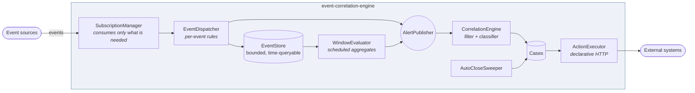

# event-correlation-engine

[](https://github.com/OmarMalas98/event-correlation-engine/actions/workflows/build.yml)


**Turns a high-volume event stream into a short list of things a human can actually work on.**

An alerting system that produces forty notifications for one outage has not helped anyone — it has
moved the problem from "we didn't know" to "we can't tell what matters". This engine sits between a
raw event stream and the people responding to it, and does three things:

1. **Detects** — per event ("this transaction took nine seconds") and per window ("failures in
   eu-west/checkout have been over 20% for five minutes"). Both are needed; neither finds what the
   other finds.
2. **Correlates** — groups the resulting alerts into *cases* using expressions supplied at runtime,
   so twelve alerts about one region become one case.
3. **Closes** — retires cases that have gone quiet, because a queue full of stale entries trains
   people to ignore the queue.

Detectors and case types are **data, not code**. They are added, edited and switched on and off
while the engine runs, which is the only way this survives contact with an operations team at 3am.

> **About this project.** An original reference implementation, written to demonstrate the
> architecture of production systems I've worked on — built with a team, and not an extract from
> any employer's codebase. No proprietary code, configuration, credentials or customer detail
> appears in it. It runs on JDK 17 and Maven with no external infrastructure, and every command
> below is shown with real captured output.

---

## Architecture



The funnel is the point: thousands of events → dozens of alerts → a handful of cases.

---

## Core concepts

### 1. Two kinds of detector, because there are two kinds of question

| | `EventDetector` | `WindowDetector` |
|---|---|---|
| Asks | Is *this event* a problem? | Is the *shape of the last N minutes* a problem? |
| Runs | On arrival | On a schedule |
| Reads | One event | Retained events in a time window |
| Catches | The single catastrophic record | The slow bleed no single event reveals |

`Detector` is a **sealed** interface, so the evaluator has to handle both kinds — adding a third
becomes a compile error rather than a detector that silently never fires.

Window detectors group by dimensions before comparing, which is what makes the output actionable.
"Error rate above 20%" tells you something is wrong; "error rate above 20% **in eu-west, on
checkout**" tells you where to look.

The `PERCENTAGE` aggregate deserves a note: set `factField` to a 0/1 flag and the threshold becomes
a *rate* alarm rather than a count. A count of 50 failures means nothing without knowing whether the
denominator was 60 or 6,000,000.

### 2. Subscriptions follow the active detector set

`SubscriptionManager` consumes a topic if and only if some active detector needs it. The trap is
that **topics are shared** — five detectors may sit on `payments`, and deactivating one must not
blind the other four.

So it reconciles against the whole required set rather than reacting to individual changes: compute
what is needed now, open what is missing, close what is not. That makes the operation idempotent —
it can be re-run at any time without reasoning about which change triggered it — and removes the
per-topic counter that would otherwise drift out of sync after a missed decrement.

This is also why `EventStream` is a port with `subscribe`/`close` rather than an annotation.
Annotation-driven listeners are fixed at startup; runtime activation needs handles you can close.

### 3. Correlation: the filter and the classifier

Each case type carries two expressions, and the distinction between them is the whole idea:

- **filter** — *does this alert belong to this kind of case at all?* → boolean
  `#alert.severity == 'CRITICAL'`
- **classifier** — *which case instance?* → string
  `#alert.attribute('region')`

The classifier's **value is the case's identity**. Same value, same case. This is where correlation
is won or lost:

- Too coarse (a constant) → every unrelated problem lands in one giant case.
- Too fine (include a timestamp or event id) → every alert gets its own case, which is the alert
  list with extra steps.

One alert can match several case types, and that is deliberate rather than an oversight. A single
failure may legitimately be a regional case for the platform team *and* a service case for the
service owner. Forcing a choice serves neither — you can see both in the demo output below.

Two smaller decisions worth flagging:

- **An alert that yields a blank classifier is not correlated at all**, and says so loudly.
  Silently defaulting would either create a catch-all case holding everything, or an unbounded
  stream of anonymous ones.
- **A broken expression takes out its own case type and nothing else.** Expressions are
  configuration; one bad rule must not stop the engine working.

### 4. Auto-close, gated on evidence

Four policies — `COUNT`, `DURATION`, `BOTH`, `ANY` — plus `DISABLED`. The right one depends on the
kind of problem, so it is per case type.

Every policy is additionally gated on **all the case's alerts being resolved**. Age and alert count
are heuristics for "probably over"; an unresolved alert is evidence that it is not. Closing over the
top of one would quietly drop a live problem out of the queue, which is the worst thing this
component could do — so an unresolved alert overrides every policy.

### 5. Integrations as data

`ActionDefinition` describes an outbound HTTP call — inputs bound off the case with expressions,
placeholders substituted into URL and body, outputs pulled back out by JSON pointer.

Every organisation this kind of engine lands in wants a case to do something in *their* ticketing
system, *their* chat, *their* inventory API. Writing an integration per customer does not scale;
describing the call as a row someone can edit does. Failures are returned rather than thrown — an
action is an integration with someone else's system, and those fail routinely.

---

## Run it

Requires JDK 17+ and Maven. No broker, no database, no search cluster.

```bash
mvn spring-boot:run
```

The engine seeds a worked example on the `payments` topic: a per-event **Slow settlement** detector,
a per-window **Elevated failure rate** detector, and two case types that group the same alerts
differently — by region for the platform team, by service for service owners.

**What is loaded, and what is being consumed:**

```bash
curl -s http://localhost:8090/status
```
```json
{"detectors":2,"consumedTopics":["payments"],"openCases":0,"caseTypes":2,"alerts":0,"activeDetectors":2,"totalCases":0,"activeAlerts":0}
```

**Generate healthy background traffic, then a localised incident.** The healthy events matter — a
failure *rate* needs a denominator:

```bash
curl -s -X POST 'http://localhost:8090/simulate/healthy?count=60'
curl -s -X POST 'http://localhost:8090/simulate/incident?region=eu-west&service=checkout&count=12'
```

**Immediately, the per-event detector has already collapsed 10 alerts into one case:**

```bash
curl -s http://localhost:8090/cases
```
```json
[{"id":"47f64e2a…","caseType":"Regional health","classifier":"eu-west","priority":"P2",
  "status":"OPEN","alertCount":10,"detectors":["Slow settlement"], …}]
```

**Within ten seconds the window detector runs too.** Now there are two cases — the same alerts,
grouped two ways:

```json
[{"caseType":"Regional health","classifier":"eu-west","priority":"P2","alertCount":13,
  "detectors":["Elevated failure rate","Slow settlement"], …},
 {"caseType":"Service degradation","classifier":"checkout","priority":"P1","alertCount":3,
  "detectors":["Elevated failure rate"], …}]
```

13 alerts, 2 cases. That is the funnel working.

**Each window alert carries the evidence that produced it:**

```bash
curl -s http://localhost:8090/alerts
```
```json
{"detector":"Elevated failure rate","severity":"CRITICAL","source":"eu-west/checkout",
 "attributes":{"region":"eu-west","service":"checkout"},
 "details":{"function":"PERCENTAGE","factField":"failed","observed":50.0,"threshold":20.0,
            "comparison":">","sampleSize":20,
            "windowFrom":"2026-07-28T18:19:02.762723400Z","windowTo":"2026-07-28T18:24:02.762723400Z"}}
```

**Subscriptions track the active set. Watch the shared topic survive one detector leaving, and be
released when the last one goes:**

```bash
curl -s -X POST 'http://localhost:8090/detectors/slow-settlement/active?value=false'
```
```json
{"detector":"Slow settlement","active":false,"consumedTopics":["payments"]}
```
```bash
curl -s -X POST 'http://localhost:8090/detectors/elevated-failure-rate/active?value=false'
```
```json
{"detector":"Elevated failure rate","active":false,"consumedTopics":[]}
```

**Run a declarative action against a case** — no code, just a definition:

```bash
curl -s -X POST "http://localhost:8090/cases/$CASE_ID/actions" -H 'Content-Type: application/json' -d '{
  "id":"open-ticket","name":"Open a ticket","method":"POST",
  "url":"http://localhost:8090/stub/tickets",
  "inputs":{"region":"#case.classifier()","count":"#case.alertCount()","priority":"#case.priority()"},
  "body":"{\"summary\":\"Degradation in {region}\",\"alerts\":{count},\"priority\":\"{priority}\"}",
  "outputs":{"ticketId":"/id","ticketStatus":"/status"}
}'
```
```json
{"actionName":"Open a ticket","successful":true,"statusCode":201,
 "inputs":{"region":"checkout","count":5,"priority":"P1"},
 "outputs":{"ticketStatus":"open","ticketId":"TCK-1001"},"failure":null}
```

**To watch a case auto-close**, resolve its alerts and wait for the sweep:

```bash
curl -s -X POST http://localhost:8090/alerts/resolve-all
```

### Tests

```bash
mvn test
```

25 tests. `WindowEvaluatorTest` and `AutoCloseSweeperTest` take `now` as a parameter rather than
reading the clock — a window detector is a statement about a time range, and a test that cannot
choose the range cannot check its boundaries.

---

## Design notes

**Why SpEL for the rules?** Detector conditions and case classifiers must be editable by operators
without a release. SpEL is already in Spring, evaluates against a typed object, and is expressive
enough for real conditions. The cost is that expressions can be wrong at runtime, which is why every
evaluation site catches, logs and carries on rather than propagating.

**Why is publishing synchronous?** `InMemoryEventStream` delivers on the calling thread. That is a
simplification with one deliberate benefit: the demo and tests are fully deterministic. Publish an
event and by the time the call returns, every detector has seen it and any resulting case exists.
Asserting that under a real broker means polling and hoping.

**Why is the event store bounded?** Retention only has to outlast the longest detector window —
nothing older can change a decision. An unbounded buffer in front of a busy stream is an
out-of-memory error with a delay on it.

**Why are parsed expressions cached?** They are stable strings evaluated on every event of a topic.
Re-parsing per event puts an expression parser on the hot path for no reason.

**Why is `CaseRecord` mutable when nearly everything else is a record?** A case is a living thing —
accumulating alerts over its lifetime *is* its purpose. Mutation is confined to synchronized methods
so a burst of concurrent alerts cannot lose an entry.

---

## Simplified from production

- **The stream is in-process.** `EventStream` is the seam where Kafka goes; the dynamic
  subscribe/close shape already matches what a real consumer needs.
- **The event store is in-memory.** `EventStore` is the seam for a search index. Real window
  detection pushes the aggregation into the store rather than pulling events into the engine — at
  serious volume that difference is the whole ball game.
- **Cases and definitions are not persisted.** A restart loses them. Production wants a database
  behind `CaseRepository`, `DetectorRegistry` and `CaseTypeRegistry`.
- **Single instance.** Several instances need partitioned consumption and a shared case store, or
  two of them will open two cases for the same problem.
- **Actions are unauthenticated and posted ad hoc.** Real ones are stored, versioned, credentialed
  from a secret manager, and retried with backoff.
- **No workflow.** Production cases usually run a process — assignment, escalation, approval — on a
  workflow engine. `CaseRecord` holds the state a workflow would drive.
- **No notification channels.** Email, chat and paging hang off the same publisher the correlation
  stage subscribes to.

---

## Part of a set

Four standalone projects, each isolating one problem from systems I've worked on in production.
They live in separate repositories and each runs on its own.

| Project | Language | The problem |
|---|---|---|
| **edge-relay-gateway** | Java | Serving public HTTP traffic for a private service the gateway is not allowed to connect to |
| **multitenant-relay-router** | Java | Passwordless auth, per-tenant credentials, and one request answered by many backends at once |
| **event-correlation-engine** — *you are here* | Java | Collapsing a high-volume event stream into a short list of things a human can work on |
| **analytics-control-plane** | Kotlin | Provisioning dependent artifacts into a system with no transactions — and undoing it cleanly |

---

## Licence

MIT — see [LICENSE](LICENSE).
